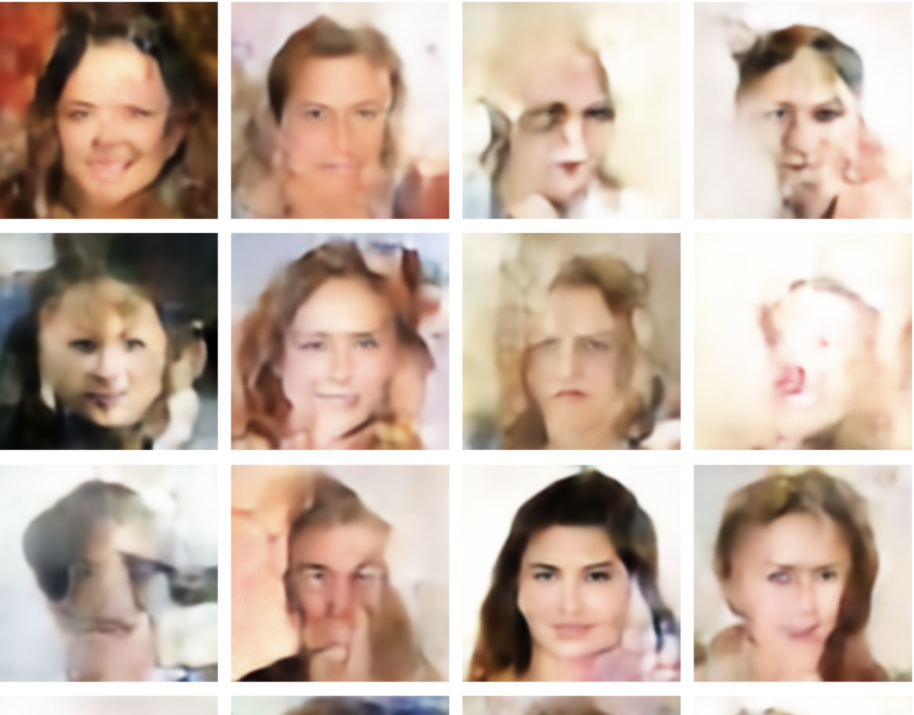
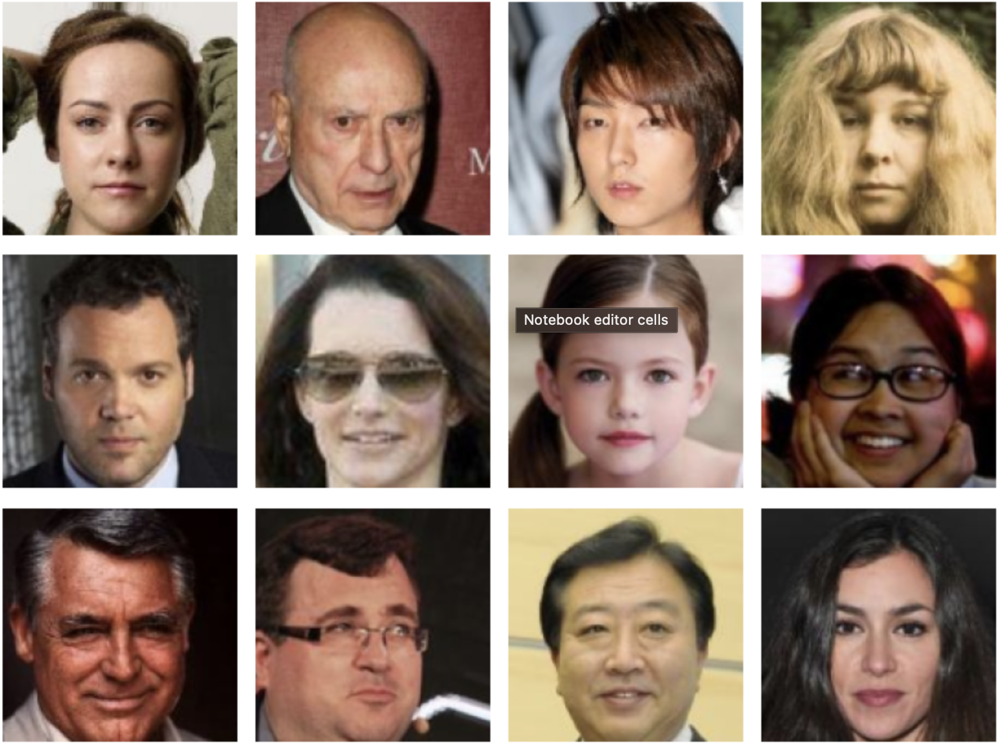
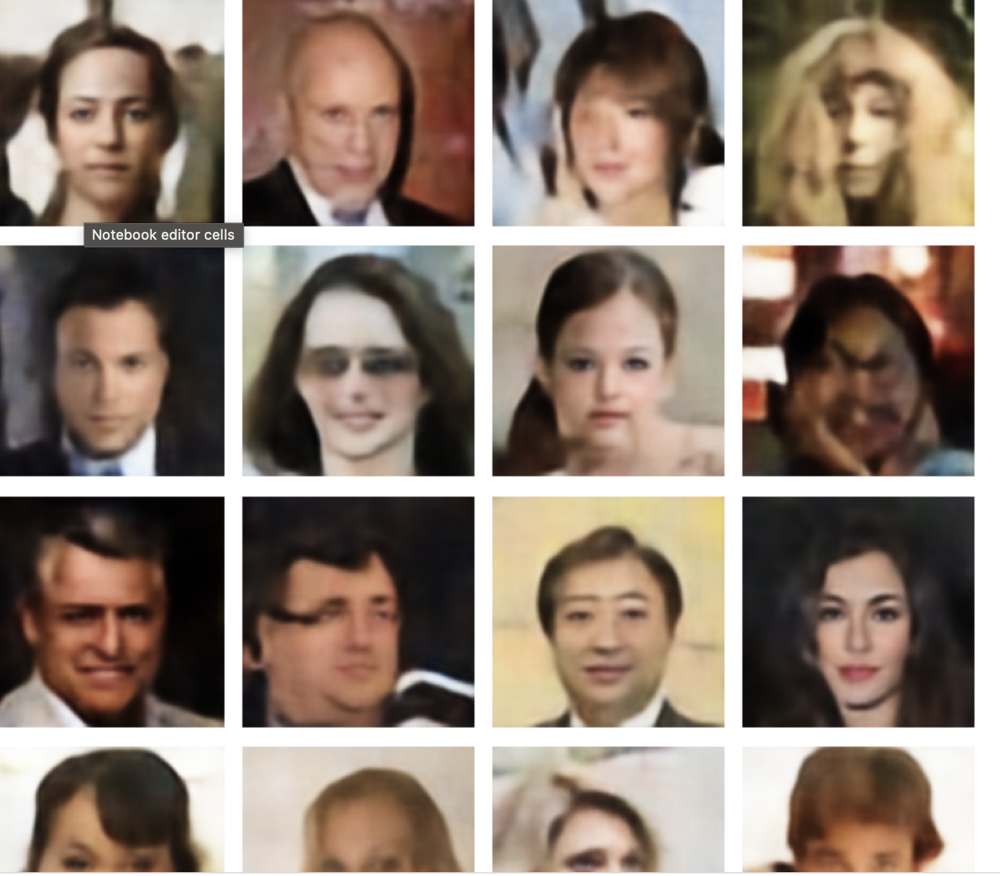
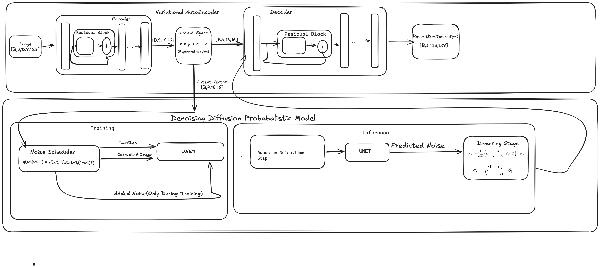

# Latent Diffusion Model from Scratch
Implemented complete latent diffusion model architecture 
(similar to Stable Diffusion) from scratch using PyTorch,
without any diffusion libraries.
###Architecture

# Results

## Generated Image

## Original Image

## Reconstructed Image

## Architecture

### VAE
- Encoder: 3 → 64 → 128 → 8 channels with residual blocks
- Latent space: 4 channels at 16x16
- Decoder: 4 → 256 → 128 → 64 → 3 channels

### DDPM
- UNet with sinusoidal time embeddings
- Self-attention at 8x8 resolution
- 1000 diffusion timesteps
- Linear noise schedule

## Pipeline
Image → VAE Encoder → Latent [4,16,16] 
→ DDPM Denoising → VAE Decoder → Generated Image

## Training
### VAE
- Dataset: CelebA (200k images, 128x128)
- KL annealing for stable training
- MSE + KL divergence loss

### DDPM  
- Trained on normalized VAE latents
- Gradient clipping for stability
- Cosine annealing LR schedule

## Key Implementation Details
- Latent normalization critical for DDPM training
- 4-channel latent space (vs 128 channels = mode collapse)
- GroupNorm instead of BatchNorm for stable training
- Residual connections in VAE encoder/decoder

## Requirements
torch
torchvision
numpy
matplotlib
imageio
tqdm

## Usage
# Train VAE
python training/train_vae.py

# Train DDPM
python training/train_ddpm.py

# Generate faces
python inference/generate.py
### DDPM for 2d Datasaurus with MLP with Variance Conserving Framework

